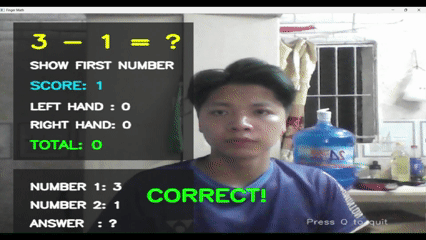

# Finger Math

Trò chơi luyện toán cộng và trừ tương tác bằng cử chỉ bàn tay. Ứng dụng sử dụng webcam để nhận diện số ngón tay, sau đó dùng các cử chỉ này làm đầu vào cho từng bước giải phép tính.

## Demo




## Điểm nổi bật

- Nhận diện tối đa hai bàn tay theo thời gian thực bằng MediaPipe Hand Landmarker.
- Đếm số ngón tay đang giơ bằng các điểm landmark của bàn tay.
- Hiển thị số ngón của từng bên và tính tổng số ngón để làm đầu vào cho trò chơi.
- Tích hợp thành trò chơi toán học: lần lượt nhập số thứ nhất, số thứ hai và đáp án bằng tổng số ngón của hai tay.
- Sinh ngẫu nhiên phép cộng và phép trừ; phép trừ luôn tạo số bị trừ không nhỏ hơn số trừ.
- Ổn định đầu vào qua nhiều khung hình liên tiếp để hạn chế nhận nhầm do cử động.
- Hiển thị câu hỏi, hướng dẫn, trạng thái kết quả và điểm số trực tiếp trên hình webcam.

## Cách chơi

1. Khởi chạy ứng dụng và cho phép truy cập webcam.
2. Làm theo hướng dẫn trên màn hình: giơ tổng số ngón tương ứng với số thứ nhất, sau đó với số thứ hai.
3. Khi màn hình yêu cầu nhập đáp án, dùng một hoặc hai bàn tay để biểu diễn đáp án bằng tổng số ngón.
4. Giữ cử chỉ ổn định trong chốc lát để ứng dụng xác nhận. Sau khi trả lời đúng, trò chơi tự tạo câu hỏi mới.
5. Nhấn **Q** để thoát.

> Mỗi bàn tay biểu diễn tối đa 5 ngón. Hãy đặt bàn tay rõ trong vùng camera và tránh để hai tay chồng lấp nếu muốn nhập tổng bằng cả hai tay.

## Công nghệ sử dụng

- **Python 3.10**
- **OpenCV** — đọc webcam, xử lý khung hình và hiển thị giao diện.
- **MediaPipe Tasks** — phát hiện bàn tay và các landmark.

## Cài đặt

### 1. Clone repository


```bash
git clone https://github.com/Nguyen-Ba-Thanh/Finger-Math.git 
cd Finger-math
```
### 2. Tạo môi trường ảo
Tạo và kích hoạt môi trường ảo (khuyến nghị):

**Windows PowerShell**

```powershell
python -m venv .venv
.\.venv\Scripts\Activate.ps1
```

**macOS / Linux**

```bash
python3 -m venv .venv
source .venv/bin/activate
```

### 3. Cài đặt dependencies

```bash
python -m pip install -r requirements.txt
```

## Chạy chương trình

Sau khi cài đặt hoàn tất, chạy:

```bash
python main.py
```
Webcam sẽ được mở và trò chơi bắt đầu.

Nhấn Q để thoát chương trình.
## Cấu trúc dự án

```text
finger_math_cv/
├── finger_counter.py       # Đếm ngón tay từ các landmark
├── hand_landmarker.task    # Mô hình MediaPipe Hand Landmarker
├── input_stabilizer.py     # Xác nhận đầu vào ổn định qua nhiều frame
├── main.py                 # Luồng ứng dụng và giao diện webcam
├── math_game.py            # Sinh câu hỏi và xử lý trạng thái trò chơi
├── requirements.txt        # Các thư viện Python cần cài đặt
└── README.md
```

## Nguyên lý hoạt động

1. OpenCV lấy hình ảnh từ webcam và lật khung hình theo chiều ngang để tạo cảm giác như gương.
2. MediaPipe phát hiện bàn tay và trả về các landmark; ứng dụng so sánh vị trí đầu ngón với các khớp để xác định số ngón đang giơ.
3. `NumberStabilizer` chỉ xác nhận một số sau khi số đó giữ ổn định qua **10 frame liên tiếp**.
4. `MathGame` điều phối các trạng thái nhập số thứ nhất, số thứ hai và đáp án; giữa các lần nhận đầu vào có khoảng chờ để tránh một cử chỉ bị tính lặp.
5. Giao diện được vẽ trực tiếp lên khung hình webcam bằng OpenCV.

## Khắc phục sự cố

- **Không mở được webcam:** kiểm tra webcam đang kết nối, đóng các ứng dụng khác đang sử dụng webcam và xác nhận camera mặc định là camera số `0`.
- **Không tải được mô hình:** xác nhận `hand_landmarker.task` nằm cùng thư mục với `main.py`.
- **Thiếu thư viện:** kích hoạt đúng môi trường ảo rồi chạy lại `python -m pip install -r requirements.txt`.
- **Đếm ngón chưa ổn định:** đưa bàn tay vào vùng nhìn của camera, giữ rõ các ngón tay và đủ ánh sáng.

## Giới hạn hiện tại

- Ứng dụng chỉ cấu hình nhận diện tối đa hai bàn tay.
- Việc phân loại tay trái/phải dựa trên vị trí bàn tay ở nửa trái hoặc nửa phải của khung hình.
- Phạm vi phép tính được thiết kế để biểu diễn bằng tối đa 10 ngón tay.
